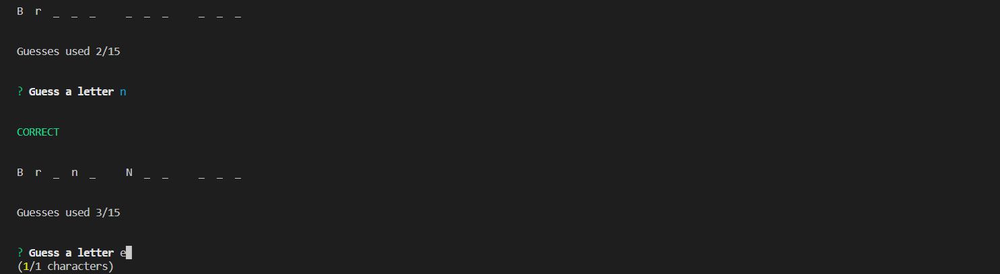
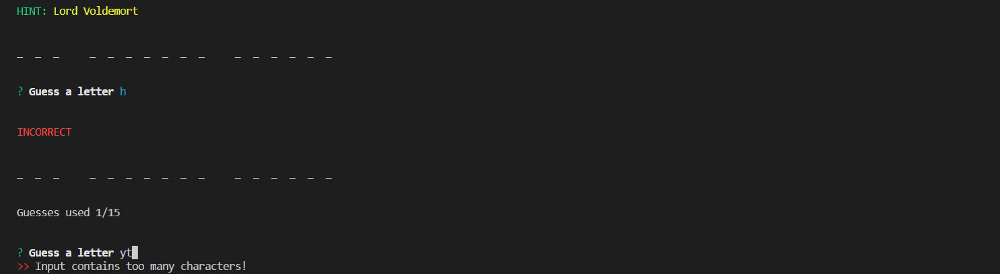

# Advanced JavaScript Assignment: Constructor Word Guess

In this unit's assignment, you will create a Word Guess command-line game using constructor functions.

### Bonuses achieved:

* using array of word objects containing HINT and WORD TO GUESS instead of array of words

### Instructions

The completed game should meet the following criteria:

1   The completed game should be able to receive user input using the inquirer or prompt npm packages.
1   Your solution should have, at minimum, three files:

* **Letter.js**: Contains a constructor, Letter. This constructor should be able to either display an underlying character or a blank placeholder (such as an underscore), depending on whether or not the user has guessed the letter. That means the constructor should define:
    *   A string value to store the underlying character for the letter
    *   A boolean value that stores whether that letter has been guessed yet
    *   A function that returns the underlying character if the letter has been guessed, or a placeholder (like an underscore) if the letter has not been guessed
    *   A function that takes a character as an argument and checks it against the underlying character, updating the stored boolean value to true if it was guessed correctly

*   **Word.js**: Contains a constructor, Word that depends on the Letter constructor. This is used to create an object representing the current word the user is attempting to guess. That means the constructor should define:
    *   An array of new Letter objects representing the letters of the underlying word
    *   A function that returns a string representing the word. This should call the function on each letter object (the first function define    Letter.js) that displays the character or an underscore and concatenate those together.
    *   A function that takes a character as an argument and calls the guess function on each letter object (the second function defined in Letter.js)

*   **index.js**: The file containing the logic for the course of the game, which depends on Word.js and:
    *   Randomly selects a word and uses the Word constructor to store it
    *   Prompts the user for each guess and keeps track of the user's remaining guesses

* Letter.js should not require any other files.
* Word.js should only require Letter.js
* **HINT**: Write Letter.js first and test it on its own before moving on, then do the same thing with Word.js
* **HINT**: If you name your letter's display function toString, JavaScript will call that function automatically whenever casting that object to a string (check out this example: https://jsbin.com/facawetume/edit?js,console)

[Clik here for video demo of the project](https://youtu.be/ZjHlaBjDAC8)

### Screenshots demo

#### Starting the game 

#### Guessing our letters, notice every new word is capitalized

#### We guessed the word, moving on next

#### Out of guesses, moving on next word

#### Trying to insert more than one letter

#### Game over, show guessed words count

_Made for U of A Bootcamp, Week-11, October 2019_